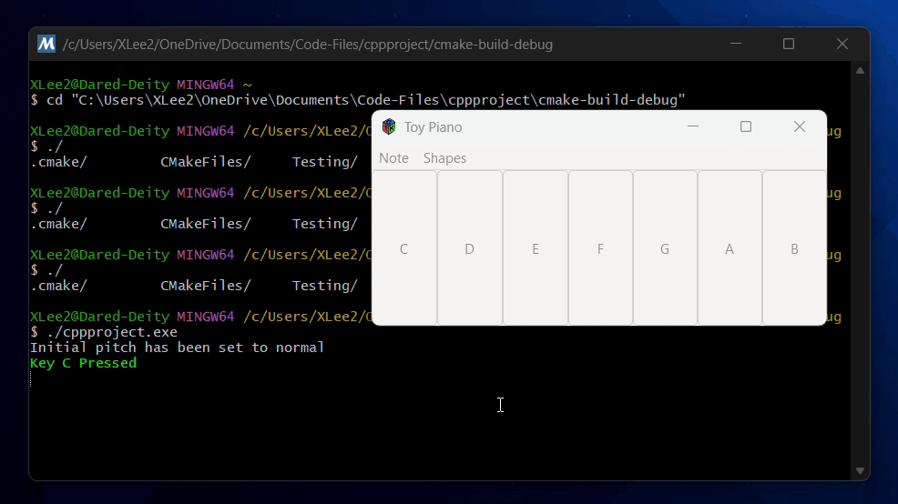

# Pianotoy in C++ using GTK

---
# Prerequisites
1. About the Program
2. Running the Application
   1. via building the source files
   2. via running the .exe file
3. Parts of the application
4. Oddities

---
## 1. About the Program

This is meant to be a simple program to demonstrate my abilities to use
C++ and the GTK UI framework to display a UI. It is a simple small keyboard that displays 7 buttons,
each of which plays a *.wav audio file when pressed. Each key has a letter on it corresponding to the note to play.
The pitch of the notes that are played can be altered through the ```Note``` button in the menubar.

The program was also used as a final project for my C++ class, specifically CS 361. 
As such, some additional features were added in order to hit what was required, such as the ```Shapes``` button in the menubar.
While these do not have much to do with a keyboard, they were added for that reason, and can be removed if desired.

---
## 2. Running the Application

In order to run the application, it requires a Windows installation with
```MSYS2 MINGW64```installed. For either 2.1 or 2.2, the following
must be downloaded and prepped in the ```MSYS2 MINGW64``` environment.

To prep you must open the ```MSYS2 MINGW64```terminal and run the following commands:

```bash
pacman -S mingw-w64-x86_64-gtk4
pacman -S mingw-w64-x86_64-toolchain base-devel
``````
### 2.1 via building the source files
- Download the source files from where ever you got them from
- Unzip the source files
  - The files must be set as follows
  ```
    src
    ├── main.cpp
    ├── shapes.h
    ├── audio.h
    └── pianokeys
        └── *Holds audio files in .wav*
    ```
- Then the main.cpp file can be ran from IDE of choice
  - **You must set up the environment to use the ```MSYS2 MINGW64``` environment**
    - In CLion you can do this by
      - Changing the environment in the settings by going to
      ```File > Settings > Build, Execution, Deployment > Toolchains```
      - Then you can add a new toolchain by clicking the ```+``` button
      - Then you can select the ```MSYS2 MINGW64``` by changing Toolset to point to ```C:\msys64\mingw64```
      - CLion will automatically detect the build tool, C compiler, and C++ compiler at this point
      - Then you can click ```OK``` and then ```Apply```
      - Make sure the toolchain is at the top of the list!
### 2.2 via running the .exe file
- Download the files and extract them to a folder.
- Open the ```MSYS2 MINGW64``` terminal and navigate to the folder.
  - ex: ```cd C:\Users\user\MyCppProgram```
- Run the program from the directory by doing:
 ```bash
    {path to the folder}/cppproject.exe
 `````` 
---

## 3. Parts of the application
The main application uses GTK4 to create the GUI. The GUI is made up of 3 main parts.
- The main window
- The piano keys
  - A series of buttons that play a note when clicked
- The menubar
  - A menu bar that has a few options
    - ```Note``` - Displays a menu that lets you change note pitches
    - ```Note > * Pitch``` - Changes the note pitch to the number (*) selected
    - ```Shapes``` - Displays a menu that will draw a shape in console
    - ```Shapes > Diamond``` - Draws a Diamond in console using * as the character
    - ```Shapes > Triangle``` - Draws a right triangle using a recursive function, using * as the character
---

## 4. Oddities
#### Why shapes in console?
- This is mainly to hit a pre-requisite for the class, as it requires shapes in console drawn, using recursive
or nested functions.

#### Why is the audio not working?
- Make sure the audio files are in the structure as shown in 2.1. **It is also required that you are running
Windows**, if you do not, then there is a chance audio will not play without changing the source code.

#### Why does ```Gtk-CRITICAL **: xx:xx:xx.xxx: gtk_main_quit: assertion 'main_loops != NULL' failed``` show up in the console?
- This is because clicking the ```X``` button is undefined in the program. GTK will try to insinuate its to close
the program, and thus will throw the error. This is not a problem, and can be ignored.

#### Must the program be ran in the ```MSYS2 MINGW64``` environment?
- At this point in time, the program must be ran in the environment. While it is possible to generate a exe file 
that will not require the environment, it is not currently set up to do so. This would require alot more time
out of my schedule that I do not have at this time. This can, however, be done later or by a user if wanted.
